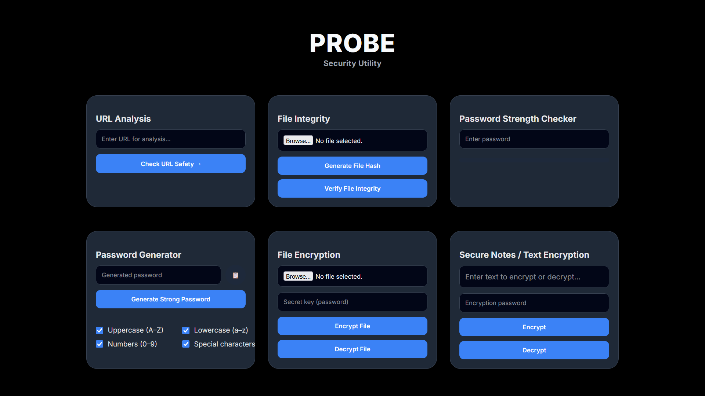

# **PROBE — SECURITY UTILITY WEB APPLICATION**

**Probe** is a full-stack cybersecurity utility web application designed to provide essential security tools through a clean, intuitive, and minimal interface. The project emphasizes real-world security use cases by combining secure backend logic, modern frontend design, and practical cryptographic implementations.

Built using **Flask** and deployed on **PythonAnywhere**, Probe demonstrates hands-on implementation of cryptography, secure file handling, and security analysis techniques commonly used in production-grade systems.

---

## **FEATURES**

### **URL SAFETY ANALYSIS**
- Rule-based URL validation and threat detection  
- Input sanitization with strict URL format validation  

### **FILE INTEGRITY VERIFICATION**
- SHA-256 hashing for integrity checks  
- Detects unauthorized or unexpected file modifications  

### **PASSWORD STRENGTH CHECKER**
- Real-time password complexity evaluation  
- Identifies weak and insecure passwords  

### **SECURE PASSWORD GENERATOR**
- Customizable character sets  
- Generates strong, cryptographically secure random passwords  

### **FILE ENCRYPTION & DECRYPTION**
- Password-based encryption  
- Secure processing and handling of user files  

### **SECURE NOTES / TEXT ENCRYPTION**
- Client-side text encryption  
- Password-protected sensitive notes  
- No server-side storage of plaintext data  

---

## **TECH STACK**

### **BACKEND**
- Python  
- Flask  

### **FRONTEND**
- HTML5  
- CSS3  
- JavaScript  

### **SECURITY & CRYPTOGRAPHY**
- AES  
- PBKDF2  
- SHA-256  

### **DEPLOYMENT**
- PythonAnywhere  

### **VERSION CONTROL**
- Git  
- GitHub  

---

## **PROJECT STRUCTURE**

```
probe-security-utility/
├── app.py
├── static/
│   ├── css/
│   └── js/
├── templates/
├── uploads/
├── requirements.txt
└── README.md

```

---

## **DEPLOYMENT**

The application is deployed on **PythonAnywhere** and follows Flask best practices for routing, static asset management, and secure request handling.

---

## **PROJECT FOCUS**

- Secure coding practices  
- Cryptography fundamentals  
- Client-side vs server-side security concepts  
- Clean and user-friendly UI/UX for security tools  
- Practical cybersecurity implementation  

---

## **FUTURE IMPROVEMENTS**

- Domain reputation scoring  
- Downloadable encrypted notes  
- API-based threat intelligence integration  
- User authentication and account management  
- Improved logging and monitoring  

---

## **LICENSE**

This project is intended strictly for **educational and demonstrational purposes**.

---

## **SCREENSHOTS**

### **DASHBOARD OVERVIEW**

